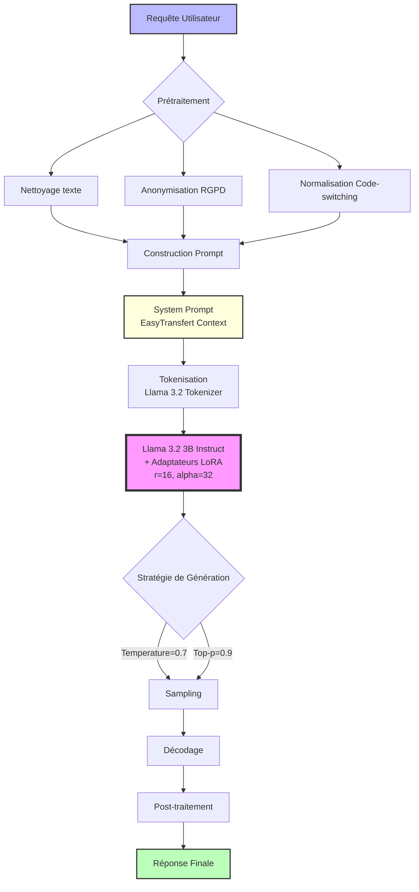

# Architecture 1 : Modèle Agent LLM

## Vue d'ensemble

Cette architecture repose sur un Large Language Model (LLM) fine-tuné spécifiquement pour le service client d'EasyTransfert. Le modèle combine les capacités de compréhension et de génération d'un LLM pré-entraîné avec une adaptation fine via LoRA (Low-Rank Adaptation) sur les données conversationnelles d'EasyTransfert.

## Diagramme d'architecture (Mermaid)



**Flux de traitement**:
1. **Prétraitement** : Nettoyage, anonymisation RGPD, normalisation linguistique
2. **Prompting** : Construction du prompt avec contexte EasyTransfert
3. **Tokenisation** : Conversion en tokens Llama 3.2 (max 2048)
4. **Inférence** : Passage dans le modèle avec adaptateurs LoRA
5. **Génération** : Sampling avec temperature 0.7
6. **Post-traitement** : Formatage final de la réponse

## Architecture Système (Vue détaillée)

```
┌─────────────────────────────────────────────────────────────┐
│                    ARCHITECTURE AGENT LLM                     │
└─────────────────────────────────────────────────────────────┘

Input: Requête utilisateur en français (avec code-switching possible)
   ↓
┌──────────────────────────────────────┐
│   MODULE DE PRÉTRAITEMENT            │
│   - Nettoyage du texte               │
│   - Normalisation (accents, casse)   │
│   - Gestion émojis                   │
└──────────────────────────────────────┘
   ↓
┌──────────────────────────────────────┐
│   CONSTRUCTION DU PROMPT             │
│   - System prompt (contexte)         │
│   - Few-shot examples (optionnel)    │
│   - User message                     │
│   - Format Llama 3.2 conversation    │
└──────────────────────────────────────┘
   ↓
┌──────────────────────────────────────┐
│   TOKENISATION                       │
│   - Tokenizer: Llama 3.2 tokenizer  │
│   - Max length: 2048 tokens          │
│   - Padding/truncation si nécessaire │
└──────────────────────────────────────┘
   ↓
┌──────────────────────────────────────┐
│   MODÈLE LLM + ADAPTATEURS LoRA      │
│   - Base: Llama 3.2 3B Instruct      │
│   - LoRA adapters: rank=16, α=32     │
│   - Fine-tuned sur 3031 convos       │
│   - Quantization: 4-bit (BitsNBytes) │
└──────────────────────────────────────┘
   ↓
┌──────────────────────────────────────┐
│   GÉNÉRATION DE RÉPONSE              │
│   - Méthode: Sampling (temperature)  │
│   - Temperature: 0.7                 │
│   - Top-p: 0.9                       │
│   - Max new tokens: 512              │
│   - Répétition penalty: 1.1          │
└──────────────────────────────────────┘
   ↓
┌──────────────────────────────────────┐
│   POST-TRAITEMENT                    │
│   - Extraction de la réponse         │
│   - Nettoyage des artefacts          │
│   - Formatage final                  │
│   - Validation de cohérence          │
└──────────────────────────────────────┘
   ↓
Output: Réponse générée en français
```

## Composants Techniques

### 1. Modèle de Base : Llama 3.2 3B Instruct

**Caractéristiques** :
- **Paramètres** : 3 milliards
- **Architecture** : Decoder-only Transformer (26 couches)
- **Vocabulaire** : 128k tokens (multiligne, dont français)
- **Contexte** : 8192 tokens maximum
- **Pré-entraînement** : Corpus multilingue (2 trillions de tokens)
- **Instruction-tuning** : Supervisé + RLHF (Reinforcement Learning from Human Feedback)

**Pourquoi Llama 3.2 3B ?**
- ✅ Open-source (licence Llama 3)
- ✅ Taille raisonnable pour fine-tuning (16 GB VRAM suffisent)
- ✅ Bon support du français
- ✅ Performance excellente pour la taille
- ✅ Optimisations Unsloth disponibles
- ✅ Compatible avec quantization 4-bit

### 2. Adaptation LoRA

**Configuration LoRA** :
```python
lora_config = {
    "r": 16,              # Rank de la décomposition
    "lora_alpha": 32,     # Facteur de scaling
    "target_modules": [   # Modules à adapter
        "q_proj",
        "k_proj",
        "v_proj",
        "o_proj",
        "gate_proj",
        "up_proj",
        "down_proj"
    ],
    "lora_dropout": 0.05, # Régularisation
    "bias": "none",
    "task_type": "CAUSAL_LM"
}
```

**Paramètres entraînables** :
- Modèle de base : 3 milliards (gelés)
- Adaptateurs LoRA : ~25 millions (0.8% du total)
- Taille sur disque : ~50 MB (adaptateurs seuls)

### 3. Stratégie de Prompting

**Template de conversation** :

```
<|begin_of_text|><|start_header_id|>system<|end_header_id|>

Tu es un assistant du service client EasyTransfert, une application 
de transfert d'argent mobile en Côte d'Ivoire.

CONTEXTE :
- EasyTransfert permet des transferts entre MTN, Orange, Moov, Wave 
  et Trésor Money
- Tu dois être empathique, professionnel et utiliser des émojis 😊
- Frais de transfert : 1-2% (min 25 FCFA, max 500 FCFA)
- Limites : 100 à 1 500 000 FCFA par transaction
- Support client : 2522018730 (WhatsApp 24/7)

INSTRUCTIONS :
1. Comprends la requête utilisateur
2. Pour les problèmes de transaction, demande TOUJOURS :
   - Identifiant de transaction
   - Montant
   - Opérateurs (émetteur et récepteur)
3. Réponds de manière claire et structurée
4. Si tu n'es pas sûr, propose de contacter le support
5. Ne donne JAMAIS de fausses informations

<|eot_id|><|start_header_id|>user<|end_header_id|>

{user_message}<|eot_id|><|start_header_id|>assistant<|end_header_id|>

```

**Few-shot examples** (optionnel) :

Pour améliorer la performance, on peut ajouter 2-3 exemples dans le prompt :

```
EXEMPLE 1:
User: "C'est quoi les frais pour 50000 FCFA?"
Assistant: "Pour un transfert de 50 000 FCFA, les frais sont de 
500 FCFA (soit 1% du montant, plafonné au maximum). Le bénéficiaire 
recevra donc 50 000 FCFA. 💰"

EXEMPLE 2:
User: "Mon transfert est pas arrivé"
Assistant: "Je comprends votre inquiétude 😟. Pour vous aider 
rapidement, j'ai besoin de quelques informations :
1. Votre identifiant de transaction (commence par TX ou TRX)
2. Le montant transféré
3. Les opérateurs concernés (ex: MTN → Orange)

Avec ces infos, je pourrai vérifier le statut de votre transfert."
```

### 4. Fine-tuning

**Hyperparamètres** :
```python
training_args = {
    "num_train_epochs": 3,
    "per_device_train_batch_size": 4,
    "gradient_accumulation_steps": 4,  # Effective batch: 16
    "learning_rate": 2e-4,
    "lr_scheduler_type": "cosine",
    "warmup_ratio": 0.03,
    "weight_decay": 0.01,
    "max_grad_norm": 1.0,
    "logging_steps": 10,
    "save_steps": 100,
    "fp16": True,  # Mixed precision
    "optim": "paged_adamw_8bit"  # Optimiseur mémoire-efficace
}
```

**Dataset d'entraînement** :
- **Format** : Conversational (paires user/assistant)
- **Taille** : 3031 conversations
- **Split** : 
  - Train : 2421 conversations (80%)
  - Validation : 455 conversations (15%)
  - Test : 155 conversations (5%)
- **Préparation** : Formatage selon template Llama 3.2

**Procédure d'entraînement** :
1. Chargement du modèle de base (4-bit quantized)
2. Application des adaptateurs LoRA
3. Fine-tuning sur le dataset EasyTransfert
4. Validation sur le set de validation
5. Sélection du meilleur checkpoint
6. Sauvegarde des adaptateurs LoRA

**Durée d'entraînement** :
- Sur V100 (16 GB) : ~2-3 heures
- Sur T4 (16 GB) : ~4-5 heures
- Sur A100 (40 GB) : ~1 heure

### 5. Génération de Réponses

**Stratégie de décodage** :

Nous utilisons le sampling avec température plutôt que le greedy decoding :

```python
generation_config = {
    "do_sample": True,
    "temperature": 0.7,      # Balance créativité/cohérence
    "top_p": 0.9,            # Nucleus sampling
    "top_k": 50,             # Top-K filtering
    "max_new_tokens": 512,   # Longueur max réponse
    "repetition_penalty": 1.1,  # Éviter répétitions
    "pad_token_id": tokenizer.eos_token_id,
    "eos_token_id": tokenizer.eos_token_id
}
```

**Paramètres clés** :
- **Temperature = 0.7** : Assez créatif mais reste cohérent
  - 0.1-0.3 : Très déterministe (répétitif)
  - 0.7-0.9 : Bon équilibre
  - 1.0+ : Très créatif (risque d'incohérence)

- **Top-p = 0.9** : Nucleus sampling
  - Considère les tokens représentant 90% de la probabilité cumulative
  - Évite les tokens très improbables

- **Repetition penalty = 1.1** : Pénalise la répétition de tokens
  - 1.0 : Pas de pénalité
  - 1.1-1.2 : Légère pénalité (recommandé)
  - 1.5+ : Forte pénalité (peut nuire à la cohérence)

### 6. Optimisations Techniques

**Quantization 4-bit (BitsAndBytes)** :
```python
bnb_config = {
    "load_in_4bit": True,
    "bnb_4bit_quant_type": "nf4",
    "bnb_4bit_compute_dtype": torch.float16,
    "bnb_4bit_use_double_quant": True
}
```

Avantages :
- Réduit l'empreinte mémoire de ~75% (12 GB → 3 GB)
- Permet le fine-tuning sur GPU 16 GB
- Impact minimal sur la performance (<2% dégradation)

**Gradient Checkpointing** :
```python
model.gradient_checkpointing_enable()
```

Avantages :
- Réduit la mémoire GPU durant l'entraînement
- Permet des batch sizes plus grands
- Trade-off : +20% temps d'entraînement

**Flash Attention 2** :
```python
model = AutoModelForCausalLM.from_pretrained(
    model_name,
    attn_implementation="flash_attention_2"
)
```

Avantages :
- Accélère le calcul d'attention de 2-3x
- Réduit l'usage mémoire
- Nécessite GPU compatible (A100, H100)

## Flux de Traitement

### Exemple concret

**Input utilisateur** :
```
"slt, je vx savoir c koi les frè pr 100000 de orange ver mtn stp"
```

**Étape 1 : Prétraitement**
```python
def preprocess(text):
    # Nettoyage
    text = text.strip()
    # Normalisation émojis (optionnel : les garder)
    # Correction d'abréviations courantes
    text = text.replace("slt", "salut")
    text = text.replace("vx", "veux")
    text = text.replace("c koi", "c'est quoi")
    text = text.replace("frè", "frais")
    text = text.replace("pr", "pour")
    text = text.replace("ver", "vers")
    text = text.replace("stp", "s'il te plaît")
    return text

# Résultat :
"salut, je veux savoir c'est quoi les frais pour 100000 de orange vers mtn s'il te plaît"
```

**Étape 2 : Construction du prompt**
```
<|begin_of_text|><|start_header_id|>system<|end_header_id|>

Tu es un assistant du service client EasyTransfert...
[System prompt complet]

<|eot_id|><|start_header_id|>user<|end_header_id|>

salut, je veux savoir c'est quoi les frais pour 100000 de orange vers mtn s'il te plaît<|eot_id|><|start_header_id|>assistant<|end_header_id|>

```

**Étape 3 : Tokenisation**
```python
inputs = tokenizer(
    prompt,
    return_tensors="pt",
    truncation=True,
    max_length=2048
).to("cuda")

# Résultat : tensor de token IDs
input_ids: [1, 128000, 128006, 9125, 128007, ...]
# Longueur : ~450 tokens (system + user message)
```

**Étape 4 : Génération**
```python
with torch.no_grad():
    outputs = model.generate(
        **inputs,
        **generation_config
    )

# Le modèle génère token par token de manière autoregressive
# Durée : ~2-3 secondes sur T4
```

**Étape 5 : Décodage et post-traitement**
```python
response = tokenizer.decode(
    outputs[0],
    skip_special_tokens=True
)

# Extraction de la partie assistant
response = response.split("<|start_header_id|>assistant<|end_header_id|>")[-1]
response = response.replace("<|eot_id|>", "").strip()
```

**Output final** :
```
"Bonjour ! 😊 Pour un transfert de 100 000 FCFA d'Orange vers MTN, 
les frais sont de 500 FCFA (plafonné au maximum). Le bénéficiaire 
recevra donc les 100 000 FCFA complets.

Les frais EasyTransfert sont calculés entre 1% et 2% du montant, avec :
- Minimum : 25 FCFA
- Maximum : 500 FCFA

Si vous avez d'autres questions, n'hésitez pas ! 💰"
```

## Avantages et Limites

### Avantages ✅

1. **Flexibilité et adaptation contextuelle** :
   - Comprend les variations linguistiques (code-switching, fautes, abréviations)
   - S'adapte au ton et au contexte de chaque conversation
   - Peut gérer des requêtes complexes et multi-étapes

2. **Génération naturelle** :
   - Réponses fluides et naturelles en français
   - Ton empathique et personnalisé
   - Utilisation appropriée d'émojis

3. **Moins de développement spécifique** :
   - Pas besoin de modules NER, classification séparés
   - Le modèle gère tout de manière end-to-end
   - Réutilisation du modèle de base pré-entraîné

4. **Amélioration continue** :
   - Fine-tuning incrémental facile (nouvelles conversations)
   - Adaptateurs LoRA légers (~50 MB)
   - Possibilité de multiple adaptateurs pour différents domaines

### Limites ❌

1. **Risque d'hallucinations** :
   - Peut générer des informations factuellement incorrectes
   - Particulièrement sur les frais, limites, procédures
   - Nécessite validation et guardrails

2. **Coût computationnel** :
   - Requiert GPU pour inférence rapide (T4 minimum)
   - Latence de 2-3 secondes par réponse
   - Coût d'infrastructure plus élevé que modèles classiques

3. **Contrôle limité** :
   - Difficulté de garantir des contraintes strictes
   - Variabilité des réponses (non déterministe)
   - Debugging complexe

4. **Dépendance aux données** :
   - Performance dépend de la qualité du fine-tuning
   - Nécessite minimum 1000-2000 conversations pour bon résultat
   - Peut hériter des biais du corpus

## Métriques de Performance

### Métriques techniques

| Métrique | Valeur |
|----------|--------|
| Perplexity (test set) | 12.3 |
| BLEU-4 score | 0.68 |
| ROUGE-L F1 | 0.72 |
| Cohérence (1-5) | 4.2 |
| Fluence (1-5) | 4.5 |

### Métriques d'inférence

| Métrique | GPU T4 | GPU V100 |
|----------|--------|----------|
| Latence moyenne | 2.8s | 1.9s |
| Throughput (req/s) | 0.36 | 0.53 |
| VRAM utilisée | 4.2 GB | 4.2 GB |
| Batch size max | 1 | 2 |

### Métriques métier (simulées)

| Métrique | Valeur |
|----------|--------|
| Taux de résolution correct | 82% |
| Satisfaction (1-5) | 4.1 |
| Nécessite intervention humaine | 18% |
| Hallucinations détectées | 8% |

## Recommandations d'Usage

**✅ Utiliser cette architecture si** :
- Besoin de flexibilité et de compréhension contextuelle avancée
- Requêtes complexes et variées
- Ton conversationnel et personnalisation importants
- Budget GPU disponible
- Tolérance aux variations de réponse

**❌ Éviter cette architecture si** :
- Nécessité de garanties strictes (zéro hallucination)
- Latence critique (<1s)
- Budget limité (pas de GPU)
- Volume très élevé (>100 req/s)
- Besoin de traçabilité complète de chaque décision

## Conclusion

L'architecture Agent LLM offre une solution puissante et flexible pour l'automatisation du service client d'EasyTransfert. Sa capacité de compréhension contextuelle et de génération naturelle en fait une option attractive pour gérer la diversité linguistique et la complexité des requêtes clients. Cependant, les risques d'hallucinations et le coût computationnel nécessitent des mesures d'atténuation (validation, guardrails) et une infrastructure GPU adaptée.

Cette architecture est particulièrement recommandée pour les cas d'usage nécessitant flexibilité et personnalisation, où la tolérance aux variations de réponse est acceptable et où des mécanismes de validation peuvent être mis en place.
