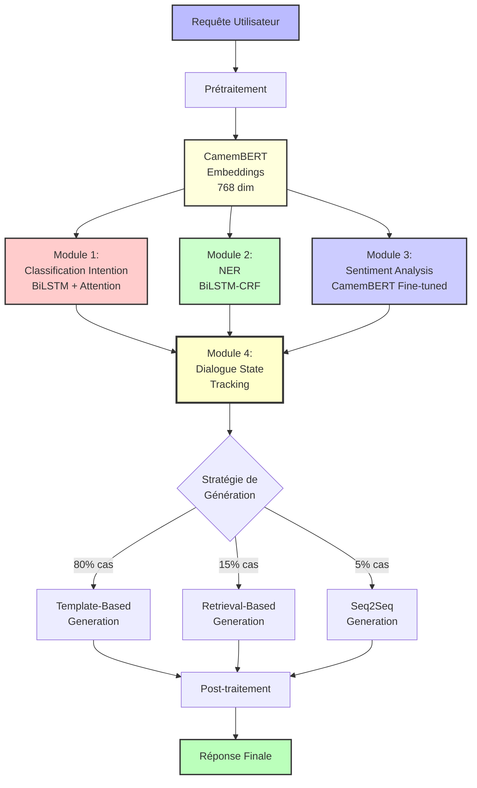
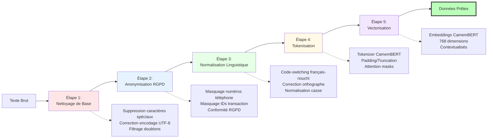

# Architecture 2 : Deep Learning + NLP Classique

## Vue d'ensemble

Cette architecture adopte une approche modulaire classique de Deep Learning appliquée au NLP, combinant plusieurs composants spécialisés qui travaillent en pipeline. Contrairement à l'approche Agent LLM end-to-end, cette architecture décompose le problème en sous-tâches distinctes (classification d'intention, extraction d'entités, génération de réponse) gérées par des modèles spécialisés.

## Diagramme d'architecture (Mermaid)



**Flux modulaire**:
1. **Prétraitement** : Pipeline identique à Architecture 1
2. **Embeddings** : CamemBERT pour représentations contextuelles
3. **Modules parallèles** :
   - Classification d'intention (10 classes)
   - Extraction d'entités (5 types)
   - Analyse de sentiment (3 classes)
4. **State Tracking** : Fusion des informations, tracking des slots
5. **Génération** : Stratégie hybride selon complexité
6. **Post-traitement** : Formatage et vérifications finales

### Diagramme de pipeline de prétraitement (Mermaid)



## Architecture Système (Vue détaillée)

```
┌───────────────────────────────────────────────────────────────┐
│        ARCHITECTURE DEEP LEARNING + NLP CLASSIQUE              │
└───────────────────────────────────────────────────────────────┘

Input: Requête utilisateur en français
   ↓
┌──────────────────────────────────────┐
│   MODULE DE PRÉTRAITEMENT            │
│   - Nettoyage du texte               │
│   - Normalisation                    │
│   - Correction d'orthographe légère  │
└──────────────────────────────────────┘
   ↓
┌──────────────────────────────────────┐
│   EMBEDDING LAYER                    │
│   - CamemBERT embeddings (768 dim)   │
│   - Contextual representations       │
└──────────────────────────────────────┘
   ↓
┌──────────────────────────────────────┐        ┌──────────────────────┐
│   MODULE 1: CLASSIFICATION           │        │  MODULE 2: NER       │
│   D'INTENTION                         │        │  (Extraction         │
│   - Architecture: BiLSTM + Attention │        │   d'entités)         │
│   - Output: Intention + confidence   │        │  - BiLSTM-CRF        │
│   - 5 classes principales            │        │  - Entities: ID,     │
└──────────────────────────────────────┘        │    phone, amount,    │
   ↓                                             │    operator          │
   ├─────────────────────────────────────────┐  └──────────────────────┘
   ↓                                         ↓         ↓
┌──────────────────────────────────────┐   ┌─────────────────────────┐
│   MODULE 3: ANALYSE DE SENTIMENT     │   │  MODULE 4: DIALOGUE     │
│   - CamemBERT fine-tuned             │   │  STATE TRACKING         │
│   - 3 classes: POS/NEG/NEU           │   │  - Gestion du contexte  │
│   - Prioritisation requêtes          │   │  - Slots à remplir      │
└──────────────────────────────────────┘   │  - Historique conv.     │
                                            └─────────────────────────┘
                                                     ↓
┌──────────────────────────────────────────────────────────┐
│   MODULE 5: GENERATION DE REPONSE                        │
│   Approche hybride:                                      │
│   - Templates dynamiques (80% des cas)                   │
│   - Retrieval-based (15% des cas)                        │
│   - Seq2Seq generation (5% cas complexes)               │
└──────────────────────────────────────────────────────────┘
   ↓
┌──────────────────────────────────────┐
│   POST-TRAITEMENT                    │
│   - Validation cohérence             │
│   - Insertion valeurs entités        │
│   - Formatage final                  │
│   - Ajout émojis appropriés          │
└──────────────────────────────────────┘
   ↓
Output: Réponse générée structurée
```

## Composants Techniques Détaillés

### Module 1 : Classification d'Intention

**Objectif** : Identifier ce que l'utilisateur veut accomplir

**Taxonomie d'intentions** (5 classes principales) :
1. `INFORMATION_GENERALE` (30% du volume)
2. `PROBLEME_TRANSACTION` (40%)
3. `PROBLEME_TECHNIQUE` (15%)
4. `COMPTE_UTILISATEUR` (10%)
5. `RECLAMATION` (5%)

**Architecture Neuronale** :

```python
class IntentClassifier(nn.Module):
    def __init__(self, num_intents=5):
        super().__init__()
        
        # Embedding layer (CamemBERT frozen)
        self.embedder = CamembertModel.from_pretrained('camembert-base')
        for param in self.embedder.parameters():
            param.requires_grad = False  # Frozen
        
        # BiLSTM layers
        self.bilstm1 = nn.LSTM(
            input_size=768,      # CamemBERT dim
            hidden_size=256,
            num_layers=1,
            batch_first=True,
            bidirectional=True
        )
        
        self.bilstm2 = nn.LSTM(
            input_size=512,      # BiLSTM output
            hidden_size=128,
            num_layers=1,
            batch_first=True,
            bidirectional=True
        )
        
        # Attention mechanism
        self.attention = nn.Linear(256, 1)
        
        # Classification head
        self.dropout = nn.Dropout(0.3)
        self.fc1 = nn.Linear(256, 64)
        self.relu = nn.ReLU()
        self.fc2 = nn.Linear(64, num_intents)
        
    def forward(self, input_ids, attention_mask):
        # CamemBERT embeddings
        outputs = self.embedder(input_ids, attention_mask)
        sequence_output = outputs.last_hidden_state  # (batch, seq_len, 768)
        
        # BiLSTM layers
        lstm_out1, _ = self.bilstm1(sequence_output)  # (batch, seq_len, 512)
        lstm_out2, _ = self.bilstm2(lstm_out1)        # (batch, seq_len, 256)
        
        # Attention mechanism
        attention_weights = torch.softmax(
            self.attention(lstm_out2).squeeze(-1),  # (batch, seq_len)
            dim=1
        )
        context = torch.sum(
            lstm_out2 * attention_weights.unsqueeze(-1),
            dim=1
        )  # (batch, 256)
        
        # Classification
        x = self.dropout(context)
        x = self.fc1(x)
        x = self.relu(x)
        x = self.dropout(x)
        logits = self.fc2(x)  # (batch, num_intents)
        
        return logits, attention_weights
```

**Hyperparamètres d'entraînement** :
```python
training_config = {
    "learning_rate": 2e-5,
    "batch_size": 32,
    "epochs": 10,
    "optimizer": "AdamW",
    "loss": "CrossEntropyLoss with class weights",
    "early_stopping_patience": 3,
    "lr_scheduler": "ReduceLROnPlateau"
}
```

**Performance attendue** :
- Accuracy : 0.91-0.94
- F1-score macro : 0.89-0.92
- Latence : ~150ms
- VRAM : ~800 MB

### Module 2 : Named Entity Recognition (NER)

**Objectif** : Extraire les entités clés des messages

**Entités à extraire** :
- `TRANSACTION_ID` : Identifiants de transaction (TX123456, TRX789012)
- `PHONE_NUMBER` : Numéros de téléphone ivoiriens (07/05/01XXXXXXXX)
- `AMOUNT` : Montants en FCFA (50000, 50k, 50 mille)
- `OPERATOR` : Opérateurs mobile money (MTN, Orange, Moov, Wave, Trésor)
- `DATE_TIME` : Dates et heures
- `PROBLEM_TYPE` : Types de problèmes (échoué, retard, erreur)

**Architecture BiLSTM-CRF** :

```python
class NERModel(nn.Module):
    def __init__(self, num_tags):
        super().__init__()
        
        # CamemBERT embeddings
        self.embedder = CamembertModel.from_pretrained('camembert-base')
        
        # BiLSTM
        self.bilstm = nn.LSTM(
            input_size=768,
            hidden_size=256,
            num_layers=2,
            batch_first=True,
            bidirectional=True,
            dropout=0.3
        )
        
        # Projection to tag space
        self.hidden2tag = nn.Linear(512, num_tags)
        
        # CRF layer
        self.crf = CRF(num_tags, batch_first=True)
        
    def forward(self, input_ids, attention_mask, tags=None):
        # Embeddings
        outputs = self.embedder(input_ids, attention_mask)
        sequence_output = outputs.last_hidden_state
        
        # BiLSTM
        lstm_out, _ = self.bilstm(sequence_output)
        
        # Tag scores
        emissions = self.hidden2tag(lstm_out)
        
        if tags is not None:
            # Training: compute CRF loss
            loss = -self.crf(emissions, tags, mask=attention_mask.byte())
            return loss
        else:
            # Inference: Viterbi decoding
            predictions = self.crf.decode(emissions, mask=attention_mask.byte())
            return predictions
```

**Schéma de tagging BIO** :
- `B-TRANSACTION_ID` : Début d'un ID transaction
- `I-TRANSACTION_ID` : Intérieur d'un ID transaction
- `B-AMOUNT` : Début d'un montant
- `O` : Outside (pas une entité)

**Exemple d'annotation** :
```
Texte: "Mon transfert TX123456 de 50000 FCFA n'est pas arrivé"
Tags:  O    O        B-TX I-TX   O  B-AMT I-AMT O    O   O    O
```

**Post-traitement** :
```python
def extract_entities(text, predictions):
    entities = {
        "transaction_ids": [],
        "amounts": [],
        "phone_numbers": [],
        "operators": [],
        "problem_types": []
    }
    
    # Extraction à partir des tags BIO
    current_entity = None
    current_text = []
    
    for token, tag in zip(text.split(), predictions):
        if tag.startswith("B-"):
            # Sauvegarder l'entité précédente
            if current_entity:
                save_entity(entities, current_entity, " ".join(current_text))
            # Démarrer nouvelle entité
            current_entity = tag[2:]
            current_text = [token]
        elif tag.startswith("I-") and current_entity:
            current_text.append(token)
        else:
            if current_entity:
                save_entity(entities, current_entity, " ".join(current_text))
                current_entity = None
                current_text = []
    
    # Normalisation et validation
    entities["amounts"] = [normalize_amount(a) for a in entities["amounts"]]
    entities["phone_numbers"] = [validate_phone(p) for p in entities["phone_numbers"]]
    
    return entities
```

### Module 3 : Analyse de Sentiment

**Objectif** : Détecter l'émotion du client (positif, négatif, neutre)

**Architecture** :
```python
# Fine-tuning de CamemBERT pour sentiment
model = CamembertForSequenceClassification.from_pretrained(
    'camembert-base',
    num_labels=3  # NEG, NEU, POS
)

# Dataset d'entraînement
# - 2000 messages annotés manuellement
# - Distribution: 40% NEG, 35% NEU, 25% POS
# - Accord inter-annotateurs: Kappa = 0.78
```

**Utilisation** :
- **Priorisation** : Messages NEGATIF → priorité haute
- **Ton de réponse** : Adapter empathie selon sentiment
- **Escalade** : NEGATIF + mots-clés urgents → agent humain

**Performance** :
- Accuracy : 0.88
- F1-score : 0.86 (micro), 0.84 (macro)
- Latence : ~100ms

### Module 4 : Dialogue State Tracking

**Objectif** : Maintenir le contexte conversationnel et gérer l'état du dialogue

**État du dialogue** :
```python
class DialogueState:
    def __init__(self):
        self.intent = None
        self.entities = {}
        self.sentiment = None
        self.missing_slots = []
        self.conversation_history = []
        self.turn_count = 0
        self.resolved = False
        
    def update(self, intent, entities, sentiment, user_message):
        self.intent = intent
        self.entities.update(entities)
        self.sentiment = sentiment
        self.conversation_history.append({
            "turn": self.turn_count,
            "role": "user",
            "message": user_message
        })
        self.turn_count += 1
        
        # Identifier les slots manquants
        self.missing_slots = self.identify_missing_slots()
        
    def identify_missing_slots(self):
        """Identifie les informations manquantes selon l'intention"""
        required_slots = {
            "PROBLEME_TRANSACTION": ["transaction_id", "amount", "operator"],
            "INFORMATION_GENERALE": [],
            "COMPTE_UTILISATEUR": ["phone_number"]
        }
        
        required = required_slots.get(self.intent, [])
        missing = [slot for slot in required if slot not in self.entities]
        return missing
```

**Gestion multi-tours** :
```
Tour 1:
User: "Mon transfert n'est pas arrivé"
State: {
  intent: PROBLEME_TRANSACTION,
  entities: {},
  missing_slots: [transaction_id, amount, operator]
}
Bot: "Je comprends. Pour vous aider, j'ai besoin de votre identifiant de transaction."

Tour 2:
User: "TX123456"
State: {
  intent: PROBLEME_TRANSACTION,
  entities: {transaction_id: "TX123456"},
  missing_slots: [amount, operator]
}
Bot: "Merci. Quel était le montant et entre quels opérateurs ?"

Tour 3:
User: "50000 FCFA de MTN vers Orange"
State: {
  intent: PROBLEME_TRANSACTION,
  entities: {
    transaction_id: "TX123456",
    amount: 50000,
    operator_from: "MTN",
    operator_to: "Orange"
  },
  missing_slots: []
}
Bot: "Parfait. Je vérifie le statut de votre transfert TX123456..."
```

### Module 5 : Génération de Réponse

**Approche hybride** : 3 stratégies selon la complexité

#### Stratégie 1 : Templates dynamiques (80% des cas)

Utilisée pour les intentions courantes avec structure prévisible :

```python
templates = {
    "INFORMATION_GENERALE": {
        "demander_frais": """
Pour un transfert de {amount} FCFA, les frais sont de {fees} FCFA.
Le bénéficiaire recevra {amount} FCFA. 💰

Les frais EasyTransfert varient entre 1% et 2% du montant :
- Minimum : 25 FCFA
- Maximum : 500 FCFA
        """,
        "demander_limites": """
Voici les limites de transfert sur EasyTransfert :

Montants :
- Minimum : 100 FCFA
- Maximum par transaction : {max_per_tx} FCFA
- Maximum quotidien : {max_per_day} FCFA

Ces limites peuvent varier selon l'opérateur. 📊
        """
    },
    
    "PROBLEME_TRANSACTION": {
        "transaction_incomplete": """
Je comprends votre problème {emoji_empathie}.

D'après votre transaction {tx_id} :
- Montant : {amount} FCFA
- {operator_from} → {operator_to}
- Statut actuel : {status}

{action_recommendation}

Si le problème persiste, contactez notre support : 2522018730 📞
        """
    }
}

def generate_from_template(intent, entities, context):
    template = templates[intent][context.subintent]
    
    # Calcul dynamique de variables
    if "fees" in template:
        entities["fees"] = calculate_fees(entities["amount"])
    
    # Remplissage du template
    response = template.format(**entities)
    
    return response
```

#### Stratégie 2 : Retrieval-based (15% des cas)

Recherche dans une base de réponses pré-écrites :

```python
from sentence_transformers import SentenceTransformer
import faiss

class ResponseRetriever:
    def __init__(self):
        # Modèle d'embedding
        self.encoder = SentenceTransformer(
            'paraphrase-multilingual-mpnet-base-v2'
        )
        
        # Base de 500 paires (question, réponse) pré-écrites
        self.responses_db = load_responses_database()
        
        # Index FAISS pour recherche rapide
        self.index = self.build_faiss_index()
    
    def retrieve(self, query, k=3):
        # Vectoriser la requête
        query_vector = self.encoder.encode([query])
        
        # Recherche des k plus proches
        distances, indices = self.index.search(query_vector, k)
        
        # Retourner la meilleure réponse
        best_idx = indices[0][0]
        best_response = self.responses_db[best_idx]["response"]
        confidence = 1 / (1 + distances[0][0])  # Normalisation
        
        return best_response, confidence
```

#### Stratégie 3 : Seq2Seq Generation (5% cas complexes)

Pour les cas non couverts par templates ou retrieval :

```python
class Seq2SeqGenerator(nn.Module):
    def __init__(self):
        super().__init__()
        
        # Encoder: CamemBERT
        self.encoder = CamembertModel.from_pretrained('camembert-base')
        
        # Decoder: LSTM with attention
        self.decoder = nn.LSTM(
            input_size=768 + 256,  # encoder output + prev hidden
            hidden_size=512,
            num_layers=2,
            batch_first=True
        )
        
        # Attention
        self.attention = BahdanauAttention(512, 768)
        
        # Output projection
        self.output_proj = nn.Linear(512, vocab_size)
        
    def forward(self, input_ids, target_ids=None):
        # Encoder
        encoder_outputs = self.encoder(input_ids).last_hidden_state
        
        # Decoder with attention (beam search inference)
        if target_ids is None:
            # Inference mode
            generated = self.beam_search(encoder_outputs, beam_size=3)
            return generated
        else:
            # Training mode
            loss = self.teacher_forcing(encoder_outputs, target_ids)
            return loss
```

**Sélection de stratégie** :
```python
def select_generation_strategy(intent, entities, dialogue_state):
    # Stratégie 1: Templates (prioritaire)
    if has_template(intent) and all_slots_filled(entities):
        return "template"
    
    # Stratégie 2: Retrieval
    elif intent in ["INFORMATION_GENERALE", "FAQ"]:
        return "retrieval"
    
    # Stratégie 3: Seq2Seq (fallback)
    else:
        return "seq2seq"
```

### Post-traitement

**Validation et enrichissement** :
```python
def post_process(response, entities, sentiment):
    # 1. Validation de cohérence
    if not is_coherent(response):
        response = fallback_response()
    
    # 2. Insertion des valeurs d'entités
    response = insert_entity_values(response, entities)
    
    # 3. Ajout d'émojis appropriés
    emoji_map = {
        "POSITIF": "😊 ✅ 👍",
        "NEGATIF": "😟 🙏",
        "NEUTRE": "📊 💰 📞"
    }
    response = add_emojis(response, sentiment, emoji_map)
    
    # 4. Formatage final
    response = format_response(response)
    
    # 5. Ajout de call-to-action si nécessaire
    if needs_followup(response):
        response += "\n\nPuis-je vous aider avec autre chose ? 😊"
    
    return response
```

## Pipeline Complet : Exemple

**Input** : "Bonjour, mon transfert de 75000 vers Orange n'est pas arrivé"

**Étape 1 : Prétraitement**
```
Texte nettoyé: "bonjour mon transfert de 75000 vers orange n'est pas arrivé"
```

**Étape 2 : Embedding (CamemBERT)**
```
Shape: (1, seq_len, 768)
```

**Étape 3 : Classification d'intention**
```
Intent: PROBLEME_TRANSACTION (confidence: 0.96)
Sub-intent: transaction_incomplete
```

**Étape 4 : NER**
```
Entities extracted:
- amount: 75000
- operator_to: "Orange"

Missing entities:
- transaction_id
- operator_from
```

**Étape 5 : Analyse de sentiment**
```
Sentiment: NEGATIF (confidence: 0.89)
→ Priorité: HAUTE
```

**Étape 6 : Dialogue State Tracking**
```
State:
  turn: 1
  intent: PROBLEME_TRANSACTION
  entities: {amount: 75000, operator_to: "Orange"}
  missing_slots: [transaction_id, operator_from]
  sentiment: NEGATIF
```

**Étape 7 : Génération (Template)**
```python
template = """
Je comprends votre inquiétude {emoji} et je vais vous aider.

Pour localiser votre transfert de {amount} FCFA vers {operator_to}, 
j'ai besoin de :
1. Votre identifiant de transaction (commence par TX ou TRX)
2. L'opérateur d'envoi

Pouvez-vous me fournir ces informations ?
"""

response = template.format(
    emoji="😟",
    amount="75 000",
    operator_to="Orange"
)
```

**Étape 8 : Post-traitement**
```
Ajout signature: "\n\nMerci de votre patience. 🙏"
```

**Output final** :
```
Je comprends votre inquiétude 😟 et je vais vous aider.

Pour localiser votre transfert de 75 000 FCFA vers Orange, 
j'ai besoin de :
1. Votre identifiant de transaction (commence par TX ou TRX)
2. L'opérateur d'envoi

Pouvez-vous me fournir ces informations ?

Merci de votre patience. 🙏
```

**Latence totale : ~400ms**

## Avantages et Limites

### Avantages ✅

1. **Contrôle et prévisibilité** :
   - Comportement déterministe et contrôlable
   - Pas de risque d'hallucination
   - Debugging facile (chaque module testé indépendamment)

2. **Performance et efficacité** :
   - Latence faible (~400ms vs 2-3s pour LLM)
   - Coût d'inférence réduit (CPU possible pour certains modules)
   - Scalabilité élevée (>10 req/s sur CPU)

3. **Modularité** :
   - Remplacement/amélioration d'un module sans tout refaire
   - Réutilisation de modules pour d'autres projets
   - Tests unitaires par module

4. **Robustesse** :
   - Gestion d'erreurs fine par module
   - Fallback strategies à chaque étape
   - Performance stable et reproductible

5. **Traçabilité** :
   - Logs détaillés de chaque décision
   - Explications faciles (quel module a fait quoi)
   - Conformité et audit facilités

### Limites ❌

1. **Complexité de développement** :
   - Multiple modèles à entraîner et maintenir
   - Pipeline complexe avec nombreuses dépendances
   - Temps de développement initial long

2. **Flexibilité limitée** :
   - Difficulté à gérer les cas imprévus
   - Nécessite des templates pour chaque intention
   - Moins naturel que la génération LLM

3. **Maintenance** :
   - Mise à jour de multiples modèles
   - Gestion de versions complexe
   - Drift de performance à surveiller par module

4. **Propagation d'erreurs** :
   - Erreur en amont affecte tous les modules suivants
   - Nécessité de seuils de confiance bien calibrés
   - Gestion des cas ambigus délicate

5. **Coverage limitée** :
   - Templates couvrent 80% des cas, les 20% restants problématiques
   - Seq2Seq génération moins performante qu'un LLM
   - Nécessite enrichissement continu de la base de templates

## Métriques de Performance

### Performances par module

| Module | Accuracy | F1-Score | Latence | VRAM |
|--------|----------|----------|---------|------|
| Intent Classification | 0.92 | 0.90 | 150ms | 800MB |
| NER | 0.89 (F1) | 0.89 | 120ms | 1GB |
| Sentiment Analysis | 0.88 | 0.86 | 100ms | 800MB |
| Response Generation (avg) | - | - | 50-200ms | Varies |
| **TOTAL PIPELINE** | - | - | **~400ms** | **2.5GB** |

### Métriques métier (simulées)

| Métrique | Valeur |
|----------|--------|
| Taux de résolution correct | 85% |
| Satisfaction (1-5) | 4.0 |
| Nécessite intervention humaine | 15% |
| Hallucinations | 0% (pas de génération libre) |
| Cohérence des réponses | 95% |

### Métriques opérationnelles

| Métrique | CPU (8 cores) | GPU T4 |
|----------|---------------|--------|
| Throughput (req/s) | 2.5 | 8 |
| Latence p50 | 400ms | 350ms |
| Latence p95 | 600ms | 450ms |
| Coût par 1M requêtes | $5 | $12 |

## Recommandations d'Usage

**✅ Utiliser cette architecture si** :
- Nécessité de garanties strictes (zéro hallucination)
- Latence critique (<500ms)
- Budget infrastructure limité
- Volume élevé de requêtes
- Traçabilité et explainability critiques
- Cas d'usage bien définis et stables

**❌ Éviter cette architecture si** :
- Requêtes très variées et imprévisibles
- Besoin de flexibilité maximale
- Équipe réduite (maintenance complexe)
- Évolution rapide des cas d'usage
- Contexte linguistique très varié

## Conclusion

L'architecture Deep Learning + NLP classique offre une solution robuste, contrôlable et efficace pour l'automatisation du service client d'EasyTransfert. Sa nature modulaire permet un contrôle fin et une prévisibilité excellente, au prix d'une complexité de développement et de maintenance plus élevée.

Cette architecture est particulièrement recommandée pour les environnements de production nécessitant des garanties strictes, une latence faible et une scalabilité élevée, où les cas d'usage sont bien définis et relativement stables.
